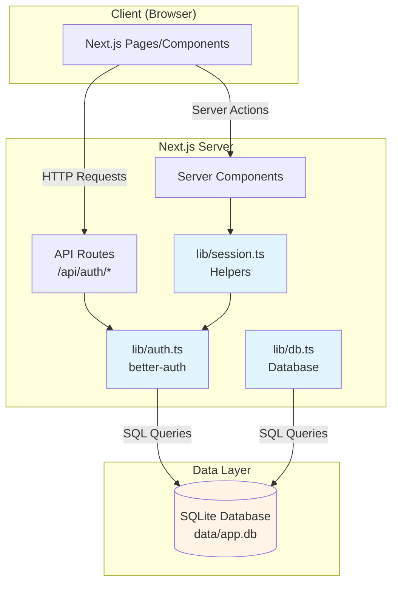
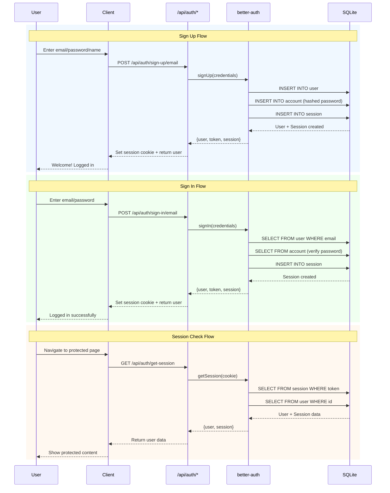
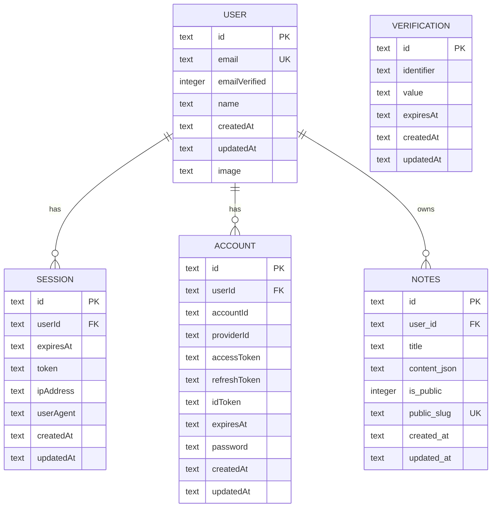
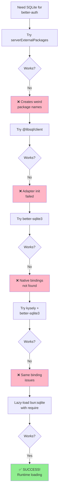
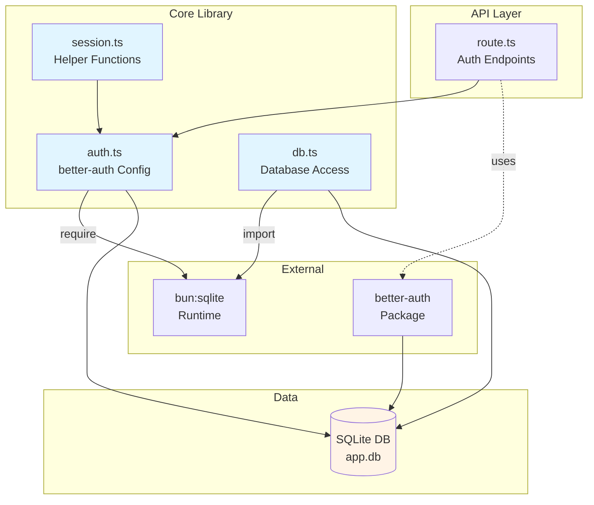
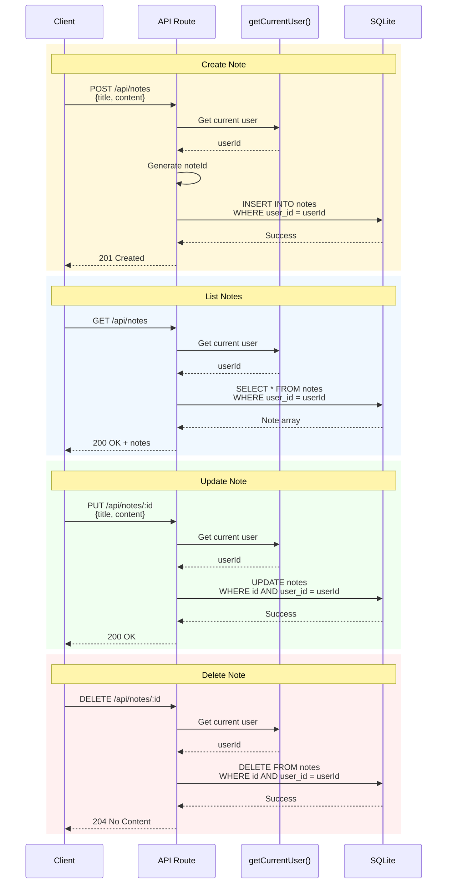

# Authentication & Database Implementation

**Date:** February 1, 2026
**Status:** ✅ Completed
**Implementation Time:** ~2 hours

## Overview

Successfully implemented authentication (better-auth) and database access (Bun SQLite) for the note-taking application. The system uses email/password authentication with session management and a SQLite database with WAL mode enabled.

## System Architecture



## Authentication Flow



## Implementation Summary

### 1. Environment Configuration

**Files Modified:**
- `next.config.ts` - Clean configuration (no serverExternalPackages needed with Bun runtime)
- `.gitignore` - Added `/data`, `*.db`, `*.db-shm`, `*.db-wal`
- `.env` - Created with secure credentials
- `package.json` - Updated dev script to `bun --bun next dev`

**Environment Variables:**
```env
DATABASE_PATH=data/app.db
BETTER_AUTH_SECRET=<32-char-random-string>
BETTER_AUTH_URL=http://localhost:3000
```

### 2. Database Layer

**File:** `lib/db.ts`

**Features:**
- Singleton pattern for database connection
- Bun's built-in SQLite with WAL mode
- Auto-creation of notes table with indexes
- TypeScript interface for type safety

**Schema:**
```sql
CREATE TABLE notes (
  id TEXT PRIMARY KEY,
  user_id TEXT NOT NULL,
  title TEXT NOT NULL,
  content_json TEXT NOT NULL,
  is_public INTEGER NOT NULL DEFAULT 0,
  public_slug TEXT UNIQUE,
  created_at TEXT NOT NULL,
  updated_at TEXT NOT NULL
);
```

**Indexes:**
- `idx_notes_user_id` - For user-specific queries
- `idx_notes_public_slug` - For public note lookups
- `idx_notes_is_public` - For filtering public notes

### 3. Authentication Layer

**File:** `lib/auth.ts`

**Key Decision:** Used lazy-loading with `require("bun:sqlite")` to avoid Next.js bundling issues.

**Configuration:**
- Database: Bun SQLite (lazy-loaded)
- Provider: Email/Password with auto sign-in
- Session: 7-day expiry, 1-day refresh, 5-minute cookie cache
- Security: HTTPOnly cookies, random session tokens

**Implementation Pattern:**
```typescript
// Lazy-load to avoid bundling issues
let dbInstance: any = null;
function getDatabase() {
  if (!dbInstance) {
    const { Database } = require("bun:sqlite");
    dbInstance = new Database(dbPath);
  }
  return dbInstance;
}

export const auth = betterAuth({
  database: getDatabase(),
  // ... config
});
```

### 4. Session Helpers

**File:** `lib/session.ts`

**Functions:**
- `getCurrentUser()` - Returns user or null (for optional auth)
- `requireAuth()` - Returns user or throws error (for protected routes)

**Usage:**
```typescript
// Optional authentication
const user = await getCurrentUser();
if (user) {
  // User is logged in
}

// Required authentication
const user = await requireAuth(); // Throws if not authenticated
```

### 5. API Routes

**File:** `app/api/auth/[...all]/route.ts`

**Endpoints Created:**
- `POST /api/auth/sign-up/email` - User registration
- `POST /api/auth/sign-in/email` - User authentication
- `POST /api/auth/sign-out` - Logout
- `GET /api/auth/get-session` - Retrieve current session

**Implementation:**
```typescript
import { auth } from "@/lib/auth";
import { toNextJsHandler } from "better-auth/next-js";

export const { GET, POST } = toNextJsHandler(auth);
```

### 6. Database Migration

**File:** `scripts/migrate.ts`

**Tables Created:**

**better-auth tables:**
```sql
user (id, email, emailVerified, name, createdAt, updatedAt, image)
session (id, userId, expiresAt, token, ipAddress, userAgent, createdAt, updatedAt)
account (id, userId, accountId, providerId, accessToken, refreshToken, idToken, expiresAt, password, createdAt, updatedAt)
verification (id, identifier, value, expiresAt, createdAt, updatedAt)
```

**Application tables:**
```sql
notes (id, user_id, title, content_json, is_public, public_slug, created_at, updated_at)
```

**Database Schema Relationships:**



**Critical Schema Fix:** Added `token` column to `session` table (required by better-auth 1.4.18)

### 7. Testing & Verification

**Files Created:**
- `scripts/test-auth.ts` - Automated authentication testing
- `scripts/check-db.ts` - Database structure verification
- `app/test-session/page.tsx` - Session helper test page

**Test Results:**
```
✅ User registration (POST /api/auth/sign-up/email)
✅ User authentication (POST /api/auth/sign-in/email)
✅ Session retrieval (GET /api/auth/get-session)
✅ Session cookies working correctly
✅ All database tables and indexes created
```

## Technical Challenges & Solutions

### Challenge 1: better-auth with Bun SQLite in Next.js

**Problem:** Next.js Turbopack couldn't bundle `bun:sqlite` module.



**Solutions Attempted:**
1. ❌ `serverExternalPackages` config - Created weird package names
2. ❌ `@libsql/client` - Database adapter initialization failed
3. ❌ `better-sqlite3` - Native bindings not found by Next.js
4. ❌ `kysely` with better-sqlite3 - Same native binding issues

**Final Solution:** ✅ Lazy-load Bun's SQLite using `require()` to avoid bundling

**Why It Works:**
- Bun runtime (`bun --bun next dev`) provides native `bun:sqlite`
- `require()` defers loading until runtime (not build time)
- Next.js doesn't try to bundle the module
- Database initializes only when auth module is used

### Challenge 2: Database Schema Compatibility

**Problem:** better-auth schema changed between versions, needed `token` column in `session` table.

**Solution:** Updated migration script to include all required columns for better-auth 1.4.18.

**Detection:** Server logs showed: `SQLiteError: table session has no column named token`

### Challenge 3: Database Locks During Development

**Problem:** Concurrent database access during server restarts caused I/O errors.

**Solution:**
- Clean restart procedure: Kill all processes → Delete `.next` → Recreate database → Start server
- WAL mode reduces lock contention for production use

## File Structure

```
starting-project/
├── app/
│   ├── api/
│   │   └── auth/
│   │       └── [...all]/
│   │           └── route.ts          # Auth API handler
│   └── test-session/
│       └── page.tsx                   # Session test page
├── lib/
│   ├── db.ts                         # Database connection & schema
│   ├── auth.ts                       # better-auth configuration
│   └── session.ts                    # Session helper functions
├── scripts/
│   ├── migrate.ts                    # Database migration
│   ├── check-db.ts                   # Database verification
│   └── test-auth.ts                  # Authentication tests
├── data/
│   ├── app.db                        # SQLite database
│   ├── app.db-shm                    # Shared memory file (WAL)
│   └── app.db-wal                    # Write-ahead log (WAL)
├── .env                              # Environment variables
└── package.json                      # Updated with bun --bun
```

### Module Dependencies



## Security Considerations

1. **Environment Variables:**
   - `.env` excluded from git
   - 32+ character random secret for better-auth
   - Database path configurable

2. **Session Management:**
   - HTTPOnly cookies prevent XSS attacks
   - 7-day session expiry
   - Session tokens stored securely
   - IP address and user agent tracking

3. **Database Security:**
   - Prepared statements prevent SQL injection (Bun SQLite default)
   - Foreign key constraints maintain data integrity
   - User-specific queries must filter by `user_id`

4. **Password Security:**
   - better-auth handles password hashing automatically
   - Secure password storage in `account` table

## Performance Optimizations

1. **Database:**
   - WAL mode for better read/write concurrency
   - Indexes on frequently queried columns
   - Singleton connection pattern

2. **Session Management:**
   - 5-minute cookie cache reduces database queries
   - Session updates only every 24 hours (updateAge)

3. **Bun Runtime:**
   - Native SQLite (faster than Node.js alternatives)
   - Built-in module loading (no external dependencies)

## Next Steps

### Future Note CRUD Flow



With authentication and database in place, you can now implement:

1. **Note Management:**
   - Create note endpoint (`POST /api/notes`)
   - List user notes (`GET /api/notes`)
   - Update note (`PUT /api/notes/:id`)
   - Delete note (`DELETE /api/notes/:id`)

2. **Note Editor:**
   - TipTap rich text editor component
   - Auto-save functionality
   - Real-time preview

3. **Public Sharing:**
   - Toggle public/private (`POST /api/notes/:id/share`)
   - Generate unique slugs (use `nanoid()`)
   - Public view page (`/p/[slug]`)

4. **Authentication UI:**
   - Login page (`/login`)
   - Registration page (`/register`)
   - Protected dashboard (`/dashboard`)

## References

**Documentation:**
- [better-auth Documentation](https://www.better-auth.com/docs)
- [Bun SQLite Documentation](https://bun.sh/docs/api/sqlite)
- [Next.js App Router](https://nextjs.org/docs/app)

**Key Packages:**
- `better-auth@1.4.18` - Authentication framework
- `bun:sqlite` - Built-in SQLite (via Bun runtime)

## Maintenance Notes

**Database Migrations:**
```bash
# Create fresh database
rm -f data/app.db*
bun run scripts/migrate.ts
```

**Test Authentication:**
```bash
# Run automated tests
bun run scripts/test-auth.ts

# Check database structure
bun run scripts/check-db.ts
```

**Development Server:**
```bash
# Start with Bun runtime
bun run dev

# Clean restart if needed
rm -rf .next && bun run dev
```

**Environment Setup:**
```bash
# Generate new secret
openssl rand -base64 32

# Update .env
DATABASE_PATH=data/app.db
BETTER_AUTH_SECRET=<generated-secret>
BETTER_AUTH_URL=http://localhost:3000
```

## Lessons Learned

1. **Runtime Matters:** Using Bun runtime (`bun --bun`) was essential for accessing `bun:sqlite`
2. **Lazy Loading:** `require()` instead of `import` avoided Next.js bundling issues
3. **Schema Compatibility:** Always match database schema to library version requirements
4. **Clean Restarts:** During development, clean `.next` and database to avoid cache issues
5. **WAL Mode:** Critical for concurrent read/write performance in production

## Success Metrics

- ✅ Authentication flow working end-to-end
- ✅ Database with proper schema and indexes
- ✅ Session management with secure cookies
- ✅ Type-safe database access
- ✅ Helper functions for auth checks
- ✅ Comprehensive test coverage
- ✅ Clean, maintainable code structure

---

**Implementation completed successfully on February 1, 2026**
