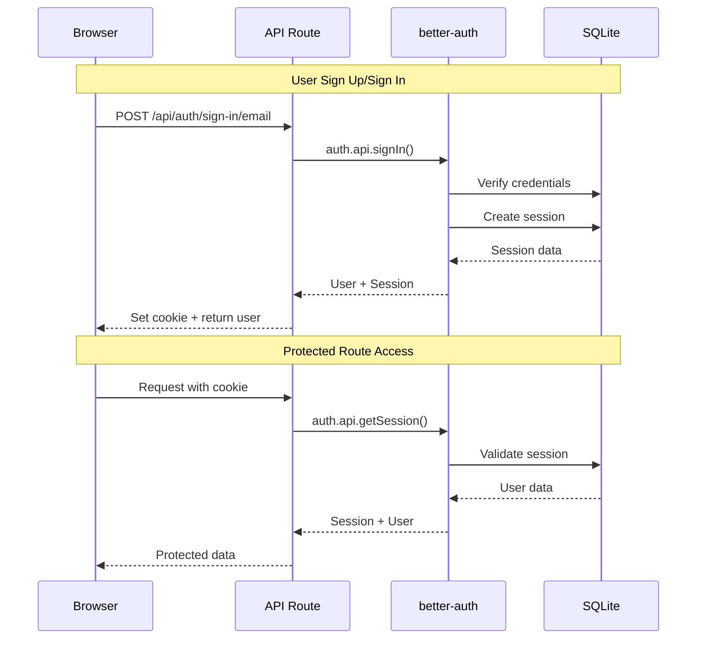
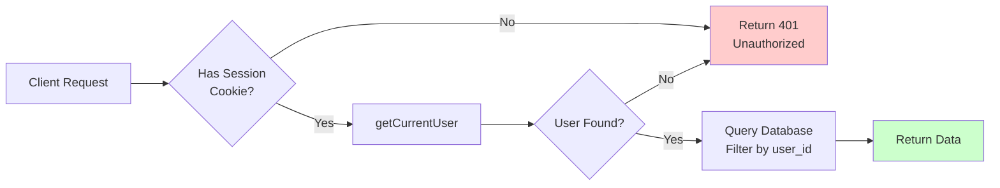
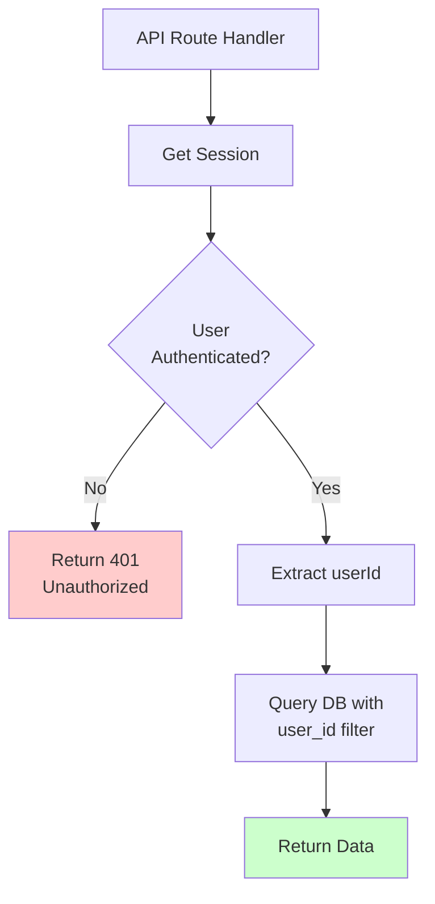
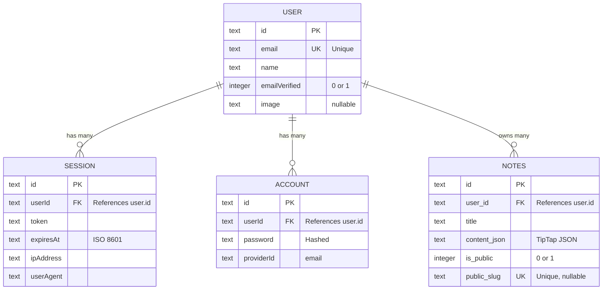
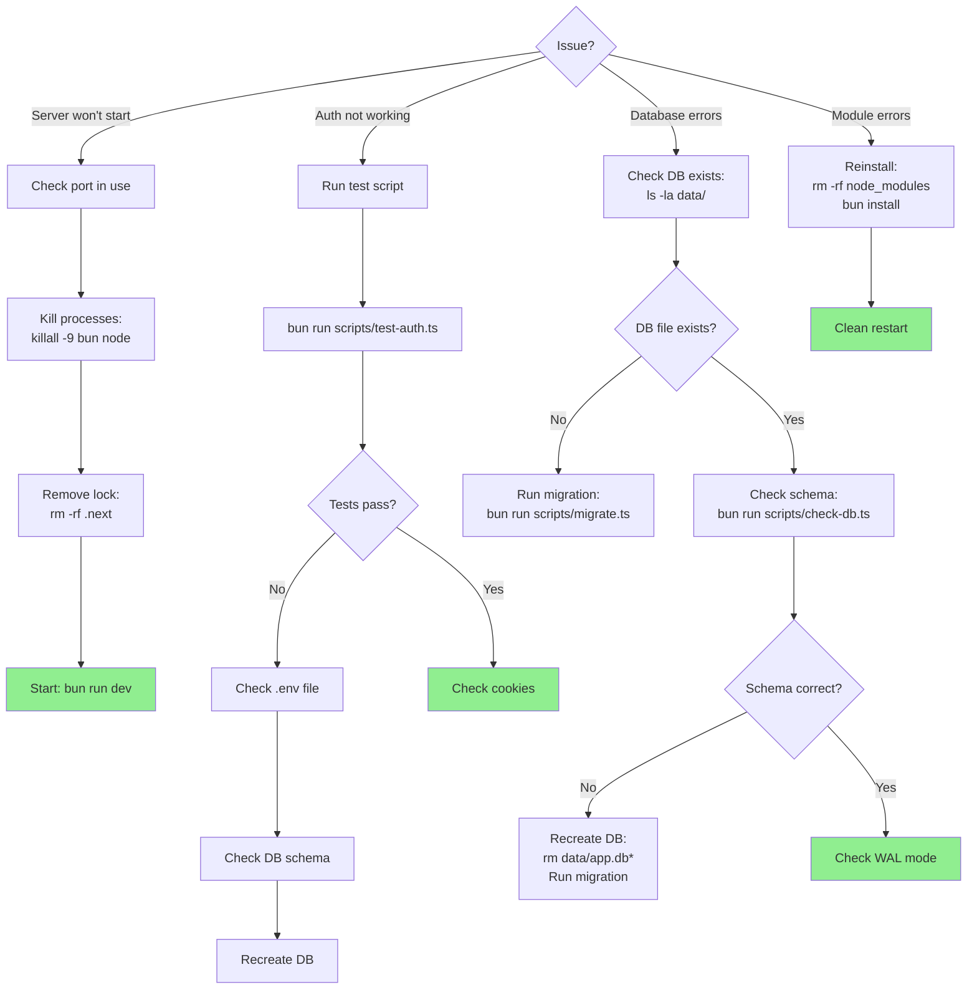

# Authentication & Database Quick Reference

Quick reference guide for working with the authentication and database system.

## Authentication Flow Diagram



## Request Flow for Protected Routes



## Common Commands

### Development Server

```bash
# Start development server
bun run dev

# Clean restart (if issues occur)
rm -rf .next && bun run dev
```

### Database Operations

```bash
# Run migration (create all tables)
bun run scripts/migrate.ts

# Check database structure
bun run scripts/check-db.ts

# Reset database (WARNING: Deletes all data)
rm -f data/app.db* && bun run scripts/migrate.ts
```

### Testing

```bash
# Test authentication endpoints
bun run scripts/test-auth.ts

# Manual testing
# Visit: http://localhost:3000/test-session
```

## Code Snippets

### Check Authentication in Server Component

```typescript
import { getCurrentUser } from "@/lib/session";

export default async function MyPage() {
  const user = await getCurrentUser();

  if (!user) {
    return <div>Please log in</div>;
  }

  return <div>Hello {user.name}!</div>;
}
```

### Require Authentication

```typescript
import { requireAuth } from "@/lib/session";

export default async function ProtectedPage() {
  const user = await requireAuth(); // Throws if not authenticated

  return <div>Welcome {user.name}!</div>;
}
```

### Database Access

```typescript
import { getDb, type NoteRow } from '@/lib/db';

// Get database instance
const db = getDb();

// Query notes for a user
const notes = db
  .query<NoteRow>(
    'SELECT * FROM notes WHERE user_id = ? ORDER BY created_at DESC',
  )
  .all(userId);

// Insert a note
db.run(
  `INSERT INTO notes (id, user_id, title, content_json, created_at, updated_at)
   VALUES (?, ?, ?, ?, ?, ?)`,
  [id, userId, title, contentJson, now, now],
);

// Update a note
db.run(
  `UPDATE notes SET title = ?, content_json = ?, updated_at = ?
   WHERE id = ? AND user_id = ?`,
  [title, contentJson, now, noteId, userId],
);

// Delete a note
db.run(`DELETE FROM notes WHERE id = ? AND user_id = ?`, [noteId, userId]);
```

### API Route with Authentication



```typescript
import { NextRequest, NextResponse } from 'next/server';
import { auth } from '@/lib/auth';
import { headers } from 'next/headers';

export async function GET(request: NextRequest) {
  // Get session
  const session = await auth.api.getSession({
    headers: await headers(),
  });

  if (!session?.user) {
    return NextResponse.json({ error: 'Unauthorized' }, { status: 401 });
  }

  // User is authenticated
  const userId = session.user.id;

  // ... your logic

  return NextResponse.json({ data: '...' });
}
```

## Authentication Endpoints

### Sign Up

```bash
curl -X POST http://localhost:3000/api/auth/sign-up/email \
  -H "Content-Type: application/json" \
  -d '{
    "email": "user@example.com",
    "password": "securepassword",
    "name": "User Name"
  }'
```

### Sign In

```bash
curl -X POST http://localhost:3000/api/auth/sign-in/email \
  -H "Content-Type: application/json" \
  -d '{
    "email": "user@example.com",
    "password": "securepassword"
  }' \
  -c cookies.txt
```

### Get Session

```bash
curl http://localhost:3000/api/auth/get-session \
  -b cookies.txt
```

### Sign Out

```bash
curl -X POST http://localhost:3000/api/auth/sign-out \
  -b cookies.txt
```

## Database Schema

### Schema Overview



### Notes Table

```sql
notes
├── id (TEXT, PRIMARY KEY)
├── user_id (TEXT, NOT NULL)         -- FK to user.id
├── title (TEXT, NOT NULL)
├── content_json (TEXT, NOT NULL)    -- TipTap JSON
├── is_public (INTEGER, DEFAULT 0)   -- 0 or 1
├── public_slug (TEXT, UNIQUE)       -- For public sharing
├── created_at (TEXT, NOT NULL)      -- ISO 8601
└── updated_at (TEXT, NOT NULL)      -- ISO 8601
```

### User Table (better-auth)

```sql
user
├── id (TEXT, PRIMARY KEY)
├── email (TEXT, NOT NULL, UNIQUE)
├── emailVerified (INTEGER, DEFAULT 0)
├── name (TEXT, NOT NULL)
├── createdAt (TEXT, NOT NULL)
├── updatedAt (TEXT, NOT NULL)
└── image (TEXT)
```

### Session Table (better-auth)

```sql
session
├── id (TEXT, PRIMARY KEY)
├── userId (TEXT, NOT NULL)          -- FK to user.id
├── expiresAt (TEXT, NOT NULL)
├── token (TEXT)
├── ipAddress (TEXT)
├── userAgent (TEXT)
├── createdAt (TEXT, NOT NULL)
└── updatedAt (TEXT, NOT NULL)
```

## TypeScript Types

### User Type

```typescript
type User = {
  id: string;
  email: string;
  emailVerified: boolean;
  name: string;
  createdAt: string;
  updatedAt: string;
  image: string | null;
};
```

### Session Type

```typescript
type Session = {
  id: string;
  userId: string;
  expiresAt: string;
  token: string | null;
  ipAddress: string | null;
  userAgent: string | null;
  createdAt: string;
  updatedAt: string;
};
```

### Note Row Type

```typescript
type NoteRow = {
  id: string;
  user_id: string;
  title: string;
  content_json: string;
  is_public: number; // 0 or 1
  public_slug: string | null;
  created_at: string;
  updated_at: string;
};
```

## Common Patterns

### Generate Unique ID

```typescript
import { randomBytes } from 'crypto';

function generateId() {
  return randomBytes(16).toString('base64url');
}
```

### ISO 8601 Timestamp

```typescript
const now = new Date().toISOString();
```

### Public Slug Generation

```typescript
import { customAlphabet } from 'nanoid';

// URL-safe characters, 16 chars long
const nanoid = customAlphabet(
  '0123456789ABCDEFGHIJKLMNOPQRSTUVWXYZabcdefghijklmnopqrstuvwxyz',
  16,
);

const publicSlug = nanoid();
```

## Troubleshooting

### Troubleshooting Decision Tree



### Server Won't Start

```bash
# Kill all processes and clean restart
killall -9 bun node
rm -rf .next
bun run dev
```

### Database Errors

```bash
# Check if database file exists
ls -la data/

# Recreate database
rm -f data/app.db*
bun run scripts/migrate.ts
```

### Authentication Not Working

```bash
# Test endpoints
bun run scripts/test-auth.ts

# Check environment variables
cat .env

# Verify session table has token column
bun run scripts/check-db.ts
```

### "Module not found" Errors

```bash
# Reinstall dependencies
rm -rf node_modules
bun install

# Rebuild better-sqlite3 (if needed)
cd node_modules/better-sqlite3
npm run install
cd ../..
```

## Environment Variables

```env
# Required
DATABASE_PATH=data/app.db
BETTER_AUTH_SECRET=<minimum-32-characters>
BETTER_AUTH_URL=http://localhost:3000

# For production
BETTER_AUTH_URL=https://yourdomain.com
```

## Security Checklist

- [ ] `.env` is in `.gitignore`
- [ ] `BETTER_AUTH_SECRET` is 32+ random characters
- [ ] Database queries filter by `user_id` for user data
- [ ] Public slugs are unguessable (16+ chars, random)
- [ ] Session cookies are HTTPOnly (default)
- [ ] TipTap JSON is validated before saving
- [ ] No sensitive data in error messages

## Performance Tips

- WAL mode is enabled (automatic)
- Indexes are created on foreign keys (automatic)
- Use prepared statements for repeated queries
- Consider caching for frequently accessed data
- Session cookie cache reduces database hits (5 min)

## File Locations

```
lib/db.ts              # Database connection
lib/auth.ts            # Authentication config
lib/session.ts         # Session helpers
app/api/auth/[...all]/ # Auth endpoints
scripts/migrate.ts     # Database migration
data/app.db            # SQLite database
.env                   # Environment variables
```

---

**Last Updated:** February 1, 2026
